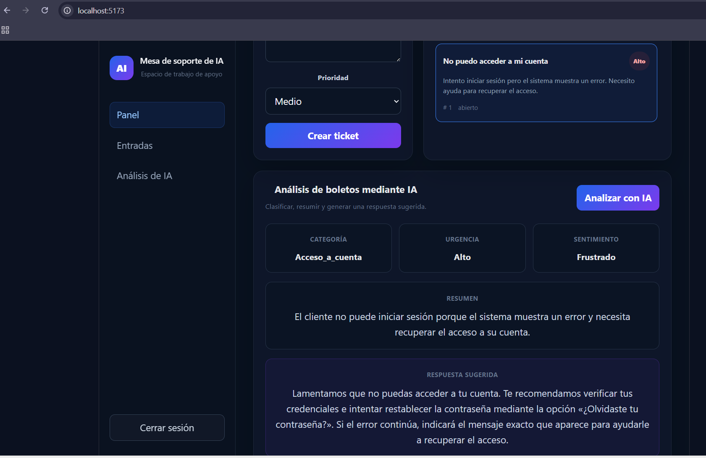

# AI Support Desk

Full-stack AI-powered customer support application built with React, FastAPI, JWT authentication, SQLAlchemy, and the OpenAI API.

AI Support Desk allows authenticated users to create and manage support tickets and use artificial intelligence to automatically classify customer requests, determine urgency and sentiment, summarize issues, and generate suggested responses.

## Features

- User registration and authentication
- JWT-based protected API endpoints
- Create and list support tickets
- Ticket priority management
- AI-powered ticket analysis
- Automatic ticket categorization
- Urgency detection
- Customer sentiment analysis
- Automatic issue summaries
- AI-generated support responses
- Responsive React dashboard
- REST API built with FastAPI
- Interactive Swagger API documentation
- Secure environment-variable configuration

## AI Ticket Analysis

For each support ticket, the AI can generate structured information such as:

```json
{
  "category": "account_access",
  "urgency": "high",
  "summary": "The customer cannot access their account.",
  "sentiment": "frustrated",
  "suggested_response": "Hello, we can help you recover access to your account..."
}
```

## Tech Stack

### Backend

- Python
- FastAPI
- SQLAlchemy
- JWT Authentication
- OpenAI API
- SQLite
- python-dotenv
- Uvicorn

### Frontend

- React
- Vite
- JavaScript
- CSS
- Fetch API

## Project Structure

```text
ai-support-desk/
├── backend/
│   ├── app/
│   │   ├── core/
│   │   ├── models/
│   │   ├── routers/
│   │   ├── schemas/
│   │   └── services/
│   ├── main.py
│   ├── requirements.txt
│   └── .env.example
│
├── frontend/
│   ├── src/
│   │   ├── pages/
│   │   ├── services/
│   │   └── assets/
│   ├── package.json
│   └── vite.config.js
│
├── .gitignore
└── README.md
```

## API Endpoints

### Authentication

```text
POST /users/register
POST /auth/login
GET  /users/me
```

### Tickets

```text
GET    /tickets
POST   /tickets
GET    /tickets/{ticket_id}
PATCH  /tickets/{ticket_id}
DELETE /tickets/{ticket_id}
```

### AI

```text
POST /tickets/{ticket_id}/ai-response
POST /tickets/{ticket_id}/ai-analyze
```

## Running Locally

### Backend

```bash
cd backend
python -m venv venv
```

Activate the virtual environment and install dependencies:

```bash
pip install -r requirements.txt
```

Create a `.env` file based on `.env.example` and configure your environment variables.

Then start the API:

```bash
uvicorn main:app --reload
```

FastAPI will be available at:

```text
http://127.0.0.1:8000
```

Swagger documentation:

```text
http://127.0.0.1:8000/docs
```

### Frontend

From another terminal:

```bash
cd frontend
npm install
npm run dev
```

The React application will normally be available at:

```text
http://localhost:5173
```

## Security

Sensitive information is stored using environment variables and is excluded from Git through `.gitignore`.

The repository includes `.env.example` as a configuration template. Real API keys and JWT secrets must never be committed.

## Current Status

The application currently includes a functional full-stack workflow:

1. User authentication
2. JWT-protected dashboard
3. Ticket creation and retrieval
4. FastAPI backend communication
5. AI ticket analysis through the OpenAI API
6. Structured AI results displayed in the React interface

## Roadmap

- PostgreSQL production database
- Automated tests
- Ticket editing and deletion from the dashboard
- Advanced filtering and search
- User roles and administrator dashboard
- Cloud deployment

## Author

**Kevin Rivera**

Software Development · Python · FastAPI · React · Artificial Intelligence

---

Built as a full-stack portfolio project focused on backend development and practical AI integration.

## Application Preview

