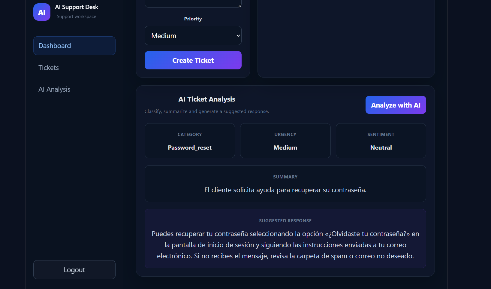

# AI Support Desk

A full-stack AI-powered customer support platform built with **React, FastAPI, SQLAlchemy, JWT authentication, and the OpenAI API**.

AI Support Desk allows authenticated users to create and manage customer support tickets and analyze them with artificial intelligence. The system automatically classifies requests, evaluates urgency and sentiment, summarizes customer issues, and generates suggested support responses.

## Live Demo

**Frontend:**  
https://ai-support-desk-1.onrender.com

> The application is deployed on Render and connected to the FastAPI backend.

## Application Preview

### AI Ticket Analysis



### Dashboard


## Features

- User registration and authentication
- JWT-protected API endpoints
- Secure login system
- Create and retrieve support tickets
- Ticket priority management
- AI-powered ticket analysis
- Automatic ticket categorization
- Urgency detection
- Customer sentiment analysis
- Automatic issue summarization
- AI-generated customer responses
- Responsive React dashboard
- REST API built with FastAPI
- Interactive Swagger API documentation
- Environment-based configuration
- Production frontend deployment

## AI Ticket Analysis

Each support ticket can be analyzed by the AI and transformed into structured information:

```json
{
  "category": "account_access",
  "urgency": "high",
  "summary": "The customer cannot access their account.",
  "sentiment": "frustrated",
  "suggested_response": "Hello, we can help you recover access to your account..."
}
```

This allows support teams to quickly understand incoming requests and prepare appropriate responses.

## Tech Stack

### Backend

- Python
- FastAPI
- SQLAlchemy
- JWT Authentication
- OpenAI API
- SQLite
- python-dotenv
- Uvicorn

### Frontend

- React
- Vite
- JavaScript
- CSS
- Fetch API

### Deployment

- Render
- GitHub
- Environment Variables

## Project Structure

```text
ai-support-desk/
├── backend/
│   ├── app/
│   │   ├── core/
│   │   ├── models/
│   │   ├── routers/
│   │   ├── schemas/
│   │   └── services/
│   ├── main.py
│   ├── requirements.txt
│   └── .env.example
│
├── frontend/
│   ├── src/
│   │   ├── pages/
│   │   ├── services/
│   │   └── assets/
│   ├── package.json
│   └── vite.config.js
│
├── screenshots/
├── .gitignore
└── README.md
```

## API Endpoints

### Authentication

```text
POST /users/register
POST /auth/login
GET  /users/me
```

### Tickets

```text
GET    /tickets
POST   /tickets
GET    /tickets/{ticket_id}
PATCH  /tickets/{ticket_id}
DELETE /tickets/{ticket_id}
```

### Artificial Intelligence

```text
POST /tickets/{ticket_id}/ai-response
POST /tickets/{ticket_id}/ai-analyze
```

## Running Locally

### 1. Clone the repository

```bash
git clone <repository-url>
cd ai-support-desk
```

### 2. Backend

```bash
cd backend
python -m venv venv
```

Activate the virtual environment.

Windows:

```bash
venv\Scripts\activate
```

Install dependencies:

```bash
pip install -r requirements.txt
```

Create a `.env` file based on `.env.example`.

Example:

```env
OPENAI_API_KEY=your_openai_api_key_here
JWT_SECRET_KEY=your_secure_jwt_secret_here
ACCESS_TOKEN_EXPIRE_MINUTES=60
DATABASE_URL=sqlite:///./ai_support_desk.db
```

Start FastAPI:

```bash
uvicorn main:app --reload
```

Backend:

```text
http://127.0.0.1:8000
```

Swagger documentation:

```text
http://127.0.0.1:8000/docs
```

### 3. Frontend

Open another terminal:

```bash
cd frontend
npm install
npm run dev
```

The development frontend will normally be available at:

```text
http://localhost:5173
```

For production, the frontend API URL can be configured with:

```env
VITE_API_URL=https://your-backend-url.com
```

## Security

Sensitive configuration is managed through environment variables.

The project uses:

- JWT authentication
- Protected API routes
- Environment-based secrets
- `.gitignore` protection for `.env` files
- Ownership checks for ticket operations

The repository contains `.env.example` only as a configuration template.

**Never commit real API keys or JWT secrets.**

## Current Status

The core full-stack workflow is operational:

1. User authentication
2. JWT-protected dashboard
3. Ticket creation and retrieval
4. React ↔ FastAPI communication
5. AI ticket analysis
6. AI categorization and urgency detection
7. Sentiment analysis
8. AI-generated support responses
9. Structured AI results displayed in the dashboard
10. Public frontend deployment

## Roadmap

- PostgreSQL production database
- Automated backend tests
- Ticket editing and deletion from the dashboard
- Advanced ticket filtering and search
- User roles and administrator dashboard
- Analytics and support metrics
- CI/CD improvements

## What This Project Demonstrates

This project demonstrates practical experience with:

- Full-stack application development
- REST API design
- Python backend development
- React frontend development
- Authentication and authorization
- Relational database integration
- AI API integration
- Structured LLM outputs
- Environment and secret management
- Cloud deployment
- Git/GitHub workflow

## Author

**Kevin Rivera**

Software Development · Python · FastAPI · React · Artificial Intelligence

---

Built as a full-stack portfolio project focused on backend engineering and practical AI integration.